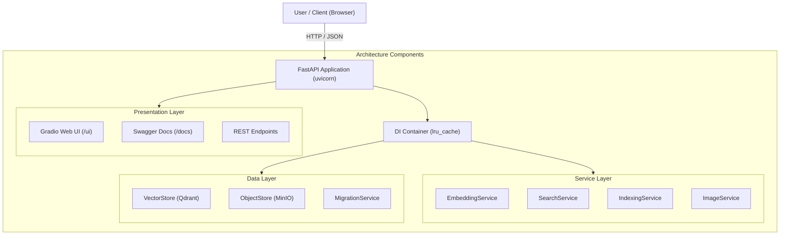

<a id="readme-top"></a>

# CLIP Fashion-Products Image Retrieval Engine

A multimodal search engine specialized for fashion, powered by AI. Search your product collection using natural language or visual similarity.

*Checkout the links:*

[](https://huggingface.co/spaces/anhquanlam/CLIP-Fashion-Product-Search)
[](https://huggingface.co/anhquanlam/clip-finetuned-deepfashion)
[](https://huggingface.co/datasets/anhquanlam/clip-deepfashion-multimodal)
[](https://www.youtube.com/watch?v=6h3SuES8a-M)

*Note: This is a production-oriented MVP visual search service. The core
retrieval pipeline is complete; production deployment now includes CI, Redis/RQ
workers, API key protection, metrics, and operational runbooks.*

## Screenshots

<p align="center">
  
  <br>
  <em>Starting App</em>
</p>

<p align="center">
  
  <br>
  <em>Text Search: "Plaid Skirt" results</em>
</p>

<p align="center">
  
  <br>
  <em>click and watch result</em>
</p>

<p align="center">
  
  <br>
  <em>Text Search: "Jean Jacket" results</em>
</p>

<p align="center">
  
  <br>
  <em>Image Upload Workflow</em>
</p>

<p align="center">
  
  <br>
  <em>Visual Similarity Search Results</em>
</p>

## Table of Contents

- [Screenshots](#screenshots)
- [Value Proposition](#value-proposition)
- [Repository Structure](#repository-structure)
- [Technical Architecture](#technical-architecture)
- [System Workflow](#system-workflow)
- [Component Breakdown](#component-breakdown)
- [Prerequisites](#prerequisites)
- [Quickstart Guide](#quickstart-guide)
- [Production Deployment](#production-deployment)
- [Evaluation & Benchmarking](#evaluation--benchmarking)
- [License](#license)

## Value Proposition

Unlike generic image search tools, this engine is purpose-built for the fashion industry, combining domain-specific AI with a robust infrastructure stack.

- **Domain-Specific CLIP:** Utilizes `anhquanlam/clip-finetuned-deepfashion`, a model fine-tuned for **30 epochs on DeepFashion**, enabling it to perceive nuanced garment attributes like textures, silhouette cuts, and intricate fashion styles.
- **Multimodal Flexibility:** Seamlessly handles both Natural Language (text) and Visual Similarity (image) queries within the same shared embedding space.
- **State-Aware Indexing:** Implements an intelligent pipeline that uses SHA256 content hashing and metadata tracking to skip redundant re-encoding, significantly reducing GPU overhead during dataset updates.
- **Cloud-Native Storage:** Leverages **Qdrant** for high-performance vector retrieval and **MinIO** for secure, scalable object storage, ensuring the system is ready for production deployment.
- **Production Readiness:** Adds Redis/RQ durable indexing jobs, API key protection, configurable upload guardrails, Prometheus metrics, structured logs, CI validation, and deployment runbooks.

## Repository Structure

### Project Tree

```text
CLIP-Image-Retrieval/
├── src/
│   ├── api/            # FastAPI routes & REST controllers
│   ├── core/           # Business logic: AI, search & background indexing
│   ├── db/             # Data access: Qdrant & MinIO wrappers
│   ├── ui/             # Gradio Web UI implementation
│   ├── config.py       # Pydantic Settings & Environment config
│   ├── server.py       # Main entrypoint: Wires API + UI
│   ├── worker.py       # RQ worker entrypoint for indexing jobs
│   └── index_enqueue.py # CLI entrypoint to enqueue indexing jobs
├── scripts/            # Migration, evaluation & benchmark tools
├── tests/              # Comprehensive test suite (API & Core)
├── docs/               # Architecture, evaluation and deployment runbooks
├── ops/                # Production ops config such as Prometheus
├── Notebook for finetuning/  # CLIP training on DeepFashion
├── docker-compose.yml  # Multi-container stack definition
├── docker-compose.prod.yml # Production compose stack
├── Dockerfile          # Optimized build via 'uv'
├── pyproject.toml      # Dependency management
└── Makefile            # Developer shortcut commands
```

### Main components details

| Directory / File | Description |
| :--- | :--- |
| **`src/core/`** | The "brain" of the app. Handles CLIP inference (lazy-loaded), search coordination, and incremental indexing with SHA256 hashing. |
| **`src/db/`** | Abstraction layer for persistence. Manages Qdrant vector collections and MinIO object storage (S3-compatible). |
| **`src/api/`** | Exposes the service via REST. Includes health checks, asynchronous indexing job management, and search endpoints. |
| **`src/ui/`** | A user-friendly interface built with Gradio, mounted as a sub-app of the main FastAPI service. |
| **`scripts/`** | Utilities for migrations, retrieval evaluation, search benchmarks, and indexing benchmarks. |
| **`config.py`** | Centralized configuration using `pydantic-settings`. Supports `.env` files and environment overrides. |
| **`docs/deployment/`** | Production deployment, scheduled ingestion, and backup/restore runbooks. |

## Technical Architecture

The engine is built on a modular **Service-Oriented Architecture** (SOA), ensuring a clean separation between AI inference, data persistence, and the presentation layer.

### System Diagram



### Detailed Tech Stack

| Category | Tools & Technologies |
| :--- | :--- |
| **Core AI** | **CLIP (ViT-B/16)** fine-tuned with PyTorch & Transformers. Optimized for fashion semantics. |
| **Databases & Queue** | **Qdrant** (Vector Database) with HNSW indexing; **MinIO** (S3-compatible) for object storage; **Redis/RQ** for durable indexing jobs. |
| **Backend** | **FastAPI** (High-performance web framework); **Pydantic v2** for validation & settings. |
| **Frontend** | **Gradio v5** for the interactive dashboard, mounted as a sub-app. |
| **Observability** | **Prometheus metrics**, request IDs, and structured JSON logs for production diagnostics. |
| **Deployment** | **Docker & Docker Compose** for container orchestration; **uv** for fast dependency resolution; GitHub Actions for CI validation. |
| **Testing & Evaluation** | **Pytest** with async support; retrieval quality evaluation; API search and indexing benchmarks. |

## System Workflow

The platform operates through a coordinated pipeline across its core services:

1. **Ingestion Job:** The API or CLI enqueues an indexing job. In production, Redis/RQ stores job state durably and the worker executes ingestion outside the API process.
2. **State Check:** The `IndexingService` scans local directories, computing unique fingerprints for each image. It cross-references these with existing records to ensure only new or modified assets are processed.
3. **Feature Extraction:** The `EmbeddingService` employs the fine-tuned CLIP model to project images into 512-dimensional latent vectors, capturing the essential visual "essence" of the apparel.
4. **Storage & Persistence:** Processed images are persisted in **MinIO**, while their corresponding vectors and metadata are upserted into **Qdrant** using an idempotent ID system based on `uuid5`.
5. **Similarity Retrieval:** The `SearchService` translates user queries into the same vector space and performs ANN/exact search in Qdrant, returning ranked results with secure, time-limited presigned URLs.

## Component Breakdown

### 1. Service Layer (`src/core/`)

- **`EmbeddingService`**: Handles CLIP model lifecycle. Features **Lazy Loading** (model only loads upon first request) and **Inference Gating** using `threading.Condition` to prioritize search requests over background indexing.
- **`IndexingService`**: A robust pipeline for dataset ingestion. It implements **Incremental Processing** via SHA256 content hashing to ensure each image is only encoded once.
- **`SearchService`**: The primary orchestrator for multimodal queries, converting inputs into vectors and managing retrieval logic.
- **`ImageService`**: A security-focused façade that generates **Time-Limited Presigned URLs** for images, ensuring assets are not exposed directly to the public internet.

### 2. Data Layer (`src/db/`)

- **`VectorStore`**: A high-performance wrapper for Qdrant. Configured with **HNSW (M=32, ef_construct=200)** for high-recall ANN search. Uses **UUID5** mapping for idempotent point management.
- **`ObjectStore`**: Manages the lifecycle of image binaries in MinIO. Supports automated bucket provisioning and multi-worker file streaming.
- **`MigrationService`**: Facilitates the transition from legacy V1 (file-based) to V2 (database-backed) by bulk-loading existing embeddings and images.

### 3. API & UI Layer

- **FastAPI Core (`src/api/`)**: Utilizes a sophisticated **Dependency Injection** system (cached via `lru_cache`) to manage service singletons and database connections.
- **Production API Controls**: Supports API key auth, configurable image upload guardrails, request ids, `/health`, and `/metrics`.
- **Gradio Dashboard (`src/ui/`)**: A reactive interface providing real-time similarity feedback, score visualization, and multimodal query toggling.
- **App Entrypoint (`server.py`)**: Wires all components together, mounting the UI onto the API and configuring global logging and CORS policies.

## Prerequisites

Before running the project, ensure you have the following installed:

- **Docker & Docker Compose**: (Highly Recommended) For one-click orchestration of the app, Qdrant, and MinIO.
- **Python 3.11+**: For local development.
- **uv**: Astral's fast Python package manager (required for local setup via `make`).
- **Make**: To run developer shortcut commands.
- **Redis**: Required for production Redis/RQ indexing jobs.

## Quickstart Guide

### 1. Local Docker Demo

```bash
git clone https://github.com/your-username/CLIP-Image-Retrieval-Gradio-App.git
cd CLIP-Image-Retrieval-Gradio-App
docker compose up -d
```

- **Web UI:** [http://localhost:8000/ui](http://localhost:8000/ui)
- **API Docs:** [http://localhost:8000/docs](http://localhost:8000/docs)
- **Health Check:** [http://localhost:8000/health](http://localhost:8000/health)
- **MinIO Console:** [http://localhost:9001](http://localhost:9001) (Login: `minioadmin` / `minioadmin`)

### 2. Local Development

```bash
make install

cp .env.example .env  # Configure your settings

docker compose up -d qdrant minio #start database and object storage

make run #start backend api
```

## Production Deployment

Production compose uses separate `app` and `worker` services plus Redis,
Qdrant, MinIO, and Prometheus.

```bash
cp .env.production.example .env.production
# edit secrets in .env.production
make prod-config
make prod-build
make prod-up
```

Manual settings required:

- Replace `API_KEY`.
- Replace MinIO root/app credentials.
- Set production data paths and backup locations.

Runbooks:

- [Production deployment](docs/deployment/production.md)
- [Scheduled ingestion](docs/deployment/scheduled-ingestion.md)
- [Backup and restore](docs/deployment/backup-restore.md)

## Evaluation & Benchmarking

The repo includes tools to evaluate retrieval quality and operational
performance:

```bash
uv run python scripts/evaluate_retrieval.py --queries eval_queries.jsonl --top-k 10
uv run python scripts/benchmark_search.py --requests 100 --concurrency 10
uv run python scripts/benchmark_indexing.py --images-dir /path/to/images
```

See [docs/evaluation.md](docs/evaluation.md) for query-set format, metrics and
release-time evaluation guidance.

## License

Distributed under the MIT License. See `LICENSE` for more information.

----
<p align="right">(<a href="#readme-top">back to top</a>)</p>
