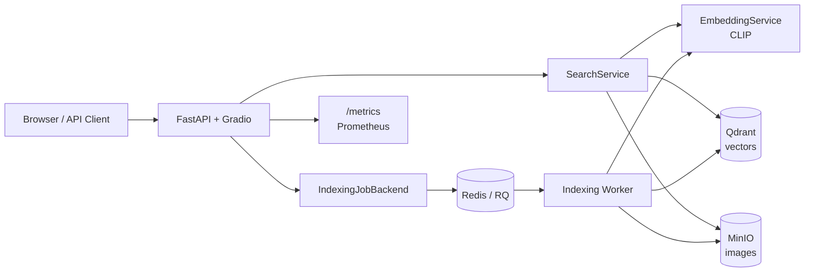

<a id="readme-top"></a>

# CLIP Fashion-Products Image Retrieval Engine

A CLIP-based image retrieval service for fashion product catalogs. It supports
text-to-image and image-to-image search, stores vectors in Qdrant, stores image
objects in MinIO, and runs indexing as background jobs through Redis/RQ in the
production stack.

The repository provides the retrieval service layer: API, UI, indexing worker,
storage adapters, metrics, deployment configuration, and evaluation tooling. It
does not include unrelated product-platform features such as user accounts,
billing, inventory management, or multi-tenant authorization.

## Links

[](https://huggingface.co/spaces/anhquanlam/CLIP-Fashion-Product-Search)
[](https://huggingface.co/anhquanlam/clip-finetuned-deepfashion)
[](https://huggingface.co/datasets/anhquanlam/clip-deepfashion-multimodal)
[](https://www.youtube.com/watch?v=6h3SuES8a-M)

## Screenshots

<p align="center">
  
  <br>
  <em>Starting App</em>
</p>

<p align="center">
  
  <br>
  <em>Text Search: "Plaid Skirt" results</em>
</p>

<p align="center">
  
  <br>
  <em>Image Upload Workflow</em>
</p>

<p align="center">
  
  <br>
  <em>Visual Similarity Search Results</em>
</p>

## What It Does

- **Text search**: type a natural-language query such as `red dress` or
  `black leather jacket`, embed it with CLIP, and retrieve visually relevant
  fashion images.
- **Image search**: upload a reference image, embed it with CLIP, and retrieve
  visually similar catalog items.
- **Incremental indexing**: scan local image folders and only encode/upload
  new or changed files by checking file metadata and SHA256 content hashes.
  Indexing retrieves only the Qdrant payload fields needed for state checks and
  writes vectors in configurable Qdrant upsert batches.
- **Background ingestion**: submit indexing jobs through the API or CLI; in the
  production stack Redis/RQ runs the long work outside the API request path.
- **Runtime operations**: API key auth, upload guardrails, Prometheus
  metrics, structured logs, Docker production compose, CI, backup/restore docs,
  and evaluation/benchmark tools.

## Architecture At A Glance



The service separates responsibilities:

- FastAPI exposes API routes and mounts the Gradio UI.
- CLIP converts text/images into vectors.
- Qdrant performs cosine similarity search over vectors.
- MinIO stores image objects and returns presigned URLs.
- Redis/RQ decouples long indexing jobs from HTTP requests.
- Prometheus reads `/metrics` for operational visibility.

For full details, start with the documentation map:

[docs/README.md](docs/README.md)

## Repository Structure

```text
.
├── src/
│   ├── api/              # FastAPI app, routes, security, schemas, DI
│   ├── core/             # Embedding, search, indexing, jobs, metrics, logging
│   ├── db/               # Qdrant, MinIO, migration wrappers
│   ├── ui/               # Gradio UI mounted at /ui
│   ├── server.py         # clip-retrieval entrypoint
│   ├── worker.py         # clip-index-worker RQ worker
│   └── index_enqueue.py  # clip-index-enqueue CLI
├── scripts/              # Migration, evaluation, benchmark utilities
├── evaluation/           # Weak-label query set and report templates
├── tests/                # Unit/API tests with fakes and in-memory Qdrant
├── docs/
│   ├── README.md         # Documentation map
│   ├── EN/               # English documentation
│   ├── VN/               # Vietnamese docs placeholder for a later pass
│   └── plans/            # Planning notes, not user-facing docs
├── ops/prometheus/       # Prometheus scrape config
├── docker-compose.yml    # Local/simple compose stack
├── docker-compose.prod.yml
├── Dockerfile
├── Makefile
└── pyproject.toml
```

## Local Development Quickstart

Use this when you are coding/debugging on your laptop.

```bash
make dev
cp .env.example .env
docker compose up -d qdrant minio
make run
```

Open:

- UI: <http://localhost:8000/ui>
- API docs: <http://localhost:8000/docs>
- Health: <http://localhost:8000/health>
- Metrics: <http://localhost:8000/metrics>
- MinIO Console: <http://localhost:9001> (`minioadmin` / `minioadmin` by default)

Local development usually uses `.env`, `localhost` service endpoints, and API
key auth disabled for convenience.

Detailed guide: [docs/EN/local-development.md](docs/EN/local-development.md)

## Production Stack Quickstart

Use this when you want to run the service like a VPS deployment. Running the
production stack locally is a close Docker Compose simulation of how it would
run on a single VPS.

```bash
cp .env.production.example .env.production
# Edit .env.production: API_KEY, MinIO credentials, paths.
make prod-config
make prod-build
make prod-up
make prod-logs
```

Production compose starts:

- `app`: FastAPI + Gradio
- `worker`: RQ indexing worker
- `redis`: queue and job metadata
- `qdrant`: vector database
- `minio`: object storage
- `prometheus`: metrics scraper

Detailed guide: [docs/EN/deployment/production.md](docs/EN/deployment/production.md)

## API Examples

Text search:

```bash
curl -X POST http://localhost:8000/api/v1/search/text \
  -H "Content-Type: application/json" \
  -H "X-API-Key: $API_KEY" \
  -d '{"query": "red dress", "top_k": 5, "search_mode": "ann"}'
```

Start indexing:

```bash
curl -X POST http://localhost:8000/api/v1/index/ \
  -H "Content-Type: application/json" \
  -H "X-API-Key: $API_KEY" \
  -d '{"images_dir": "/data/images"}'
```

Poll an indexing job:

```bash
curl -H "X-API-Key: $API_KEY" \
  http://localhost:8000/api/v1/index/<job_id>
```

API guide: [docs/EN/api.md](docs/EN/api.md)

## Evaluation And Benchmarking

Evaluate retrieval quality with the included DeepFashion weak-label query set:

```bash
uv run python scripts/evaluate_retrieval.py \
  --base-url http://localhost:8000 \
  --queries evaluation/deepfashion_weak_labels.jsonl \
  --top-k 10 \
  --search-mode ann \
  --api-key "$API_KEY"
```

Benchmark search latency:

```bash
uv run python scripts/benchmark_search.py \
  --base-url http://localhost:8000 \
  --query "red dress" \
  --requests 100 \
  --concurrency 10 \
  --api-key "$API_KEY"
```

Evaluation guide: [docs/EN/evaluation.md](docs/EN/evaluation.md)

The included query set is derived from the DeepFashion dataset filenames and is
intended as a repeatable weak-label baseline, not a human-labeled gold
benchmark.

## Development Checks

```bash
uv run pytest tests/ -v
uv run ruff check src/ tests/ scripts/
uv run mypy src tests
docker build -t clip-image-retrieval:v3-smoke .
```

## Documentation

Start here:

[docs/README.md](docs/README.md)

The English documentation under `docs/EN/` is the current authoritative
documentation set. The Vietnamese documentation folder is reserved for a later
translation pass.

## License

Distributed under the MIT License. See [LICENSE](LICENSE).

<p align="right">(<a href="#readme-top">back to top</a>)</p>
