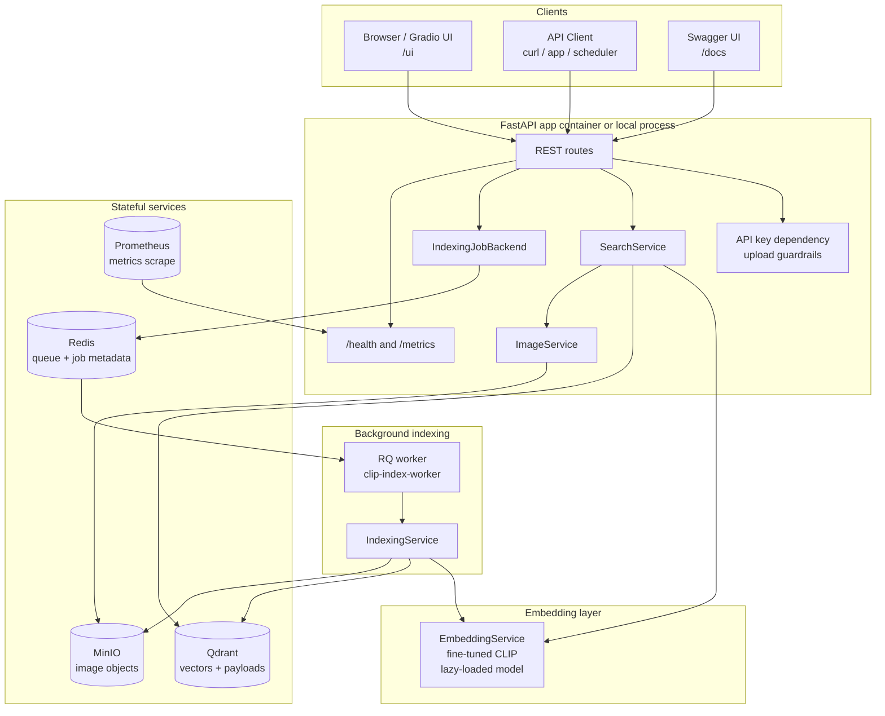

# Architecture

CLIP Fashion-Products Image Retrieval Engine is a single Python service with a
separate background worker in production mode. It exposes FastAPI routes and a
Gradio UI, uses a fine-tuned CLIP model for embeddings, stores vectors in
Qdrant, stores image binaries in MinIO, and uses Redis/RQ for durable indexing
jobs.

## High-Level Diagram



## Architectural Style

The code follows a simple service-oriented structure:

| Layer | Main modules | Responsibility |
|---|---|---|
| API/UI | `src/api`, `src/ui` | HTTP routes, request validation, API key checks, Gradio UI. |
| Core services | `src/core` | Embedding, search, indexing, job orchestration, metrics, logging. |
| Storage adapters | `src/db` | Qdrant and MinIO wrappers. |
| Runtime entrypoints | `src/server.py`, `src/worker.py`, `src/index_enqueue.py` | App process, RQ worker, CLI job enqueue. |

This separation is intentional:

- routes stay thin and do not own business logic;
- core services can be tested with fake stores and fake embeddings;
- Qdrant and MinIO details are isolated behind adapters;
- the worker can reuse the same indexing service as the API;
- local and production environments share the same code paths with different
  configuration.

## Component Responsibilities

### FastAPI Application

FastAPI owns the HTTP boundary:

- request validation through Pydantic schemas;
- route-level API key dependency for search and indexing;
- upload byte/content-type checks for image search;
- `/health` and `/metrics`;
- CORS and request-id middleware;
- mounted Gradio UI at `/ui`.

The API layer does not directly implement vector search, CLIP inference, or
MinIO operations. It calls service classes through dependency injection.

### Gradio UI

The Gradio UI is mounted into the same FastAPI app. It reuses the same
`SearchService` and `ImageService` singletons as the REST API.

This keeps the runtime simple:

- one Python app process serves API and UI;
- UI behavior uses the same core retrieval logic as API behavior;
- fewer deployment moving parts for local usage and small deployments.

Tradeoff: a high-scale product may later split UI and API into separate
services. The current design keeps that possible because UI logic is already
outside the core services.

### EmbeddingService

`EmbeddingService` wraps the Hugging Face CLIP model.

Implementation concepts:

- **Lazy loading**: the model is loaded only on the first embedding request.
  Startup stays faster and tests can avoid loading the real model.
- **Double-checked init lock**: `_init_lock` ensures concurrent first requests
  do not load the model multiple times.
- **Inference gate**: `threading.Condition` allows only one active model
  inference at a time and gives foreground search requests priority over
  background indexing.
- **Batch image embedding**: indexing can encode multiple images in one CLIP
  call through `get_image_batch_features`.

Why gate inference? CLIP/PyTorch inference is expensive. Running unbounded
concurrent inference can exhaust CPU/GPU memory. The gate makes behavior
predictable for a single-process service and prevents background indexing from fully
starving user search requests.

Tradeoff: this is still not a full model-serving system. If many users search
concurrently or if GPU utilization must be maximized, move inference to a
dedicated model server such as Triton, TorchServe, or Ray Serve.

### SearchService

`SearchService` handles read traffic:

1. Validate query or image input at the service boundary.
2. Use CLIP to produce a 512-dimensional embedding.
3. Query Qdrant with the selected search mode.
4. Return normalized `SearchResult` objects.

The API layer turns those results into response objects and signs MinIO object
keys directly in-process. Presigned URL creation is local signing work, so the
current response assembly does not create a per-request thread pool for that
step.

Supported search modes:

- `ann`: approximate search, normal production mode;
- `exact`: exact search, useful for evaluation baseline;
- `ann_indexed_only`: search only indexed segments.

### IndexingService

`IndexingService` handles write/ingestion traffic.

It scans a local image directory and incrementally reconciles local files with
Qdrant and MinIO. The goal is to avoid re-encoding and re-uploading unchanged
images.

Implementation concepts:

- It iterates image files instead of loading the entire file list into a large
  memory structure.
- It checks only the Qdrant payload fields needed for indexing state
  (`file_size`, `modified_at`, `content_hash`, and `image_path`) in state
  lookup batches, avoiding unnecessary payload transfer during large scans.
- It uses fast metadata (`file_size`, `modified_at`) to skip expensive SHA256
  reads when possible.
- It computes SHA256 only when metadata is insufficient.
- It checks MinIO object existence so Qdrant and MinIO stay consistent.
- It batch-encodes changed images.
- It uploads files to MinIO with bounded worker concurrency.
- It upserts vectors and metadata to Qdrant after each ingest batch. Qdrant
  writes are then chunked by `QDRANT_UPSERT_BATCH_SIZE`, which is separate from
  `INGEST_BATCH_SIZE`: the first controls Qdrant request size, the second
  controls CLIP image encoding batch size.

Counters returned by indexing:

| Counter | Meaning |
|---|---|
| `scanned_count` | Files inspected. |
| `indexed_count` | New images embedded and inserted. |
| `updated_count` | Existing images whose content changed. |
| `skipped_count` | Existing unchanged images. |
| `uploaded_only_count` | Vector existed, MinIO object was repaired without re-encoding. |
| `failed_count` | Files that failed inspection, upload, embedding, or upsert. |

### IndexingJobBackend

Indexing can run through two backends:

| Backend | Use case | Behavior |
|---|---|---|
| `memory` | Local development | API process uses an in-process single-worker executor. |
| `redis` | Production stack | API enqueues RQ jobs in Redis; `clip-index-worker` executes them. |

Only one indexing job can be queued/running at a time. This is deliberate. It
avoids multiple ingestion jobs competing for CLIP inference, MinIO writes, and
Qdrant upserts.

### VectorStore / Qdrant

Qdrant stores embeddings and searchable payload metadata.

The collection uses:

- vector size: 512;
- distance: cosine;
- HNSW indexing;
- deterministic point ids derived from `uuid5(NAMESPACE_URL, object_key)`.

Qdrant write batching is configurable with `QDRANT_UPSERT_BATCH_SIZE`. Keep this
separate from `INGEST_BATCH_SIZE`: increasing CLIP batch size affects memory and
model throughput, while increasing Qdrant upsert batch size affects network
request size and Qdrant write pressure.

Why UUID5? The same object key always maps to the same Qdrant point id. Reindexing
the same file updates the existing point instead of creating duplicates.

Payloads connect vectors back to object storage:

- `image_path`: MinIO object key;
- `filename`;
- `caption`;
- `content_hash`;
- `file_size`;
- `modified_at`;
- `source_path`.

### ObjectStore / MinIO

MinIO stores the actual image bytes. Qdrant does not store images.

Why not store base64 images in Qdrant?

- vector databases are optimized for vectors and payload metadata, not large
  binaries;
- object storage is better for image files, lifecycle policies, and backups;
- search responses can return presigned URLs instead of embedding large blobs
  inside JSON.

### Redis/RQ Worker

Redis stores queue and job metadata. RQ workers execute indexing jobs.

Why use Redis/RQ?

- indexing a large folder can run longer than HTTP/proxy timeouts;
- the API can return `202 Accepted` quickly;
- a worker can be restarted independently from the API;
- job status can be polled through `GET /api/v1/index/{job_id}`;
- scheduled ingestion can enqueue jobs through the same backend.

Redis is operational state, not the source of truth for image retrieval. Qdrant
and MinIO are the important persisted retrieval state.

### Observability

The app exposes:

- `/health`: model load status, Qdrant collection info, MinIO bucket name;
- `/metrics`: Prometheus metrics;
- request IDs in responses and logs;
- JSON logs when `LOG_FORMAT=json`.

Important metrics:

- HTTP request count and latency;
- search latency by kind and mode;
- CLIP embedding latency by kind and priority;
- indexing jobs by terminal status.

## Deployment Shapes

### Local Development

```text
Host machine:
  Python app via make run

Docker:
  qdrant
  minio
```

Config uses `.env` and localhost endpoints.

### Production Compose

```text
Docker:
  app
  worker
  redis
  qdrant
  minio
  prometheus
```

Config uses `.env.production` and Docker service names.

Running this stack locally is a close simulation of running the same stack on a
single VPS.

## Known Tradeoffs

- The production Docker image uses CPU PyTorch wheels for reliable, smaller
  builds. GPU production requires a separate GPU image/profile.
- API key auth is simple shared-secret auth, not full user/role management.
- Redis/RQ provides a simple durable job backend, but high-scale
  deployments may need stronger job orchestration and distributed locks.
- Gradio UI is mounted in the same app process for simplicity. A larger product
  may split frontend and API.
