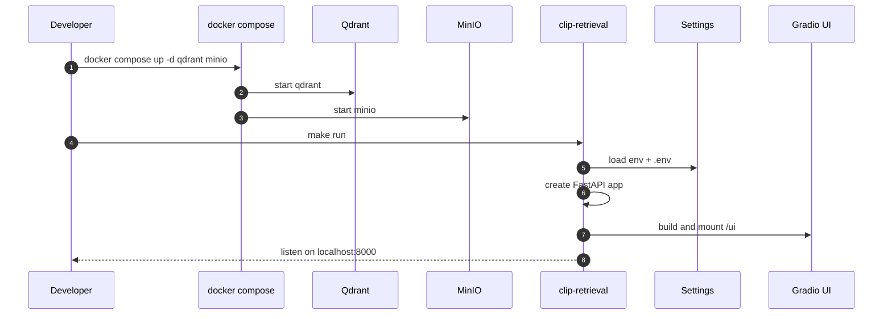
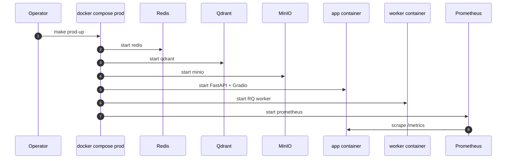
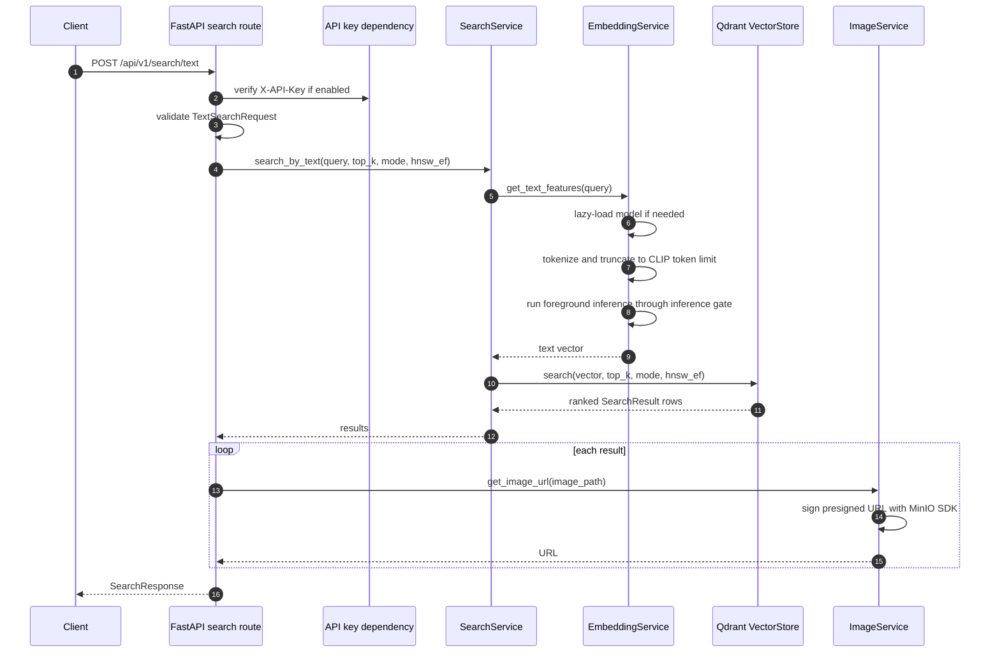
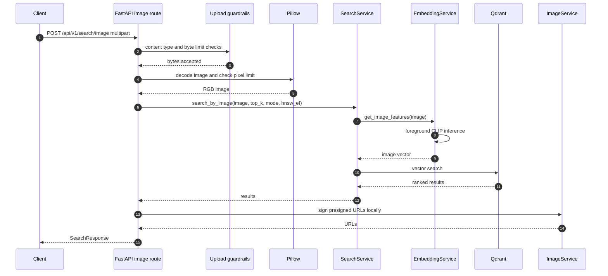
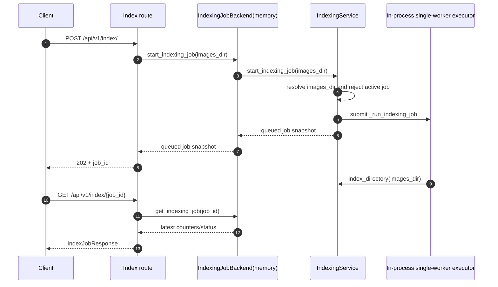
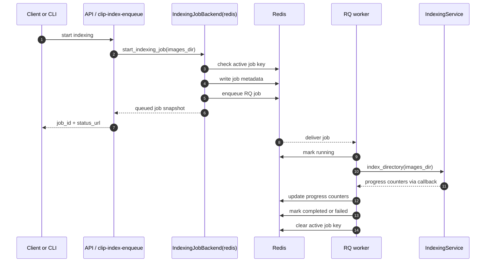
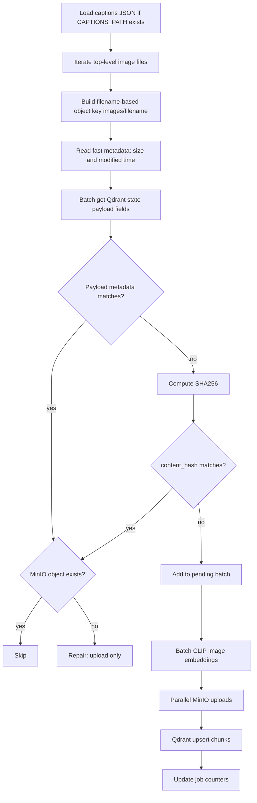
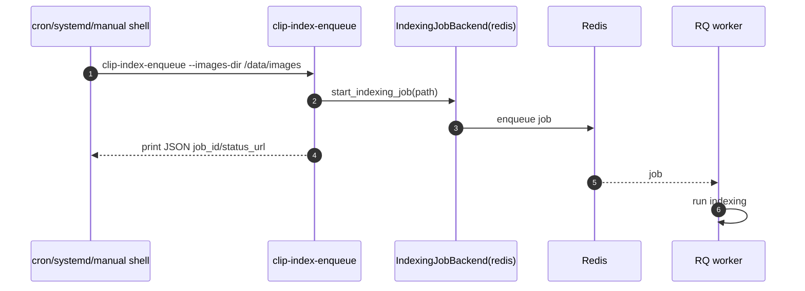
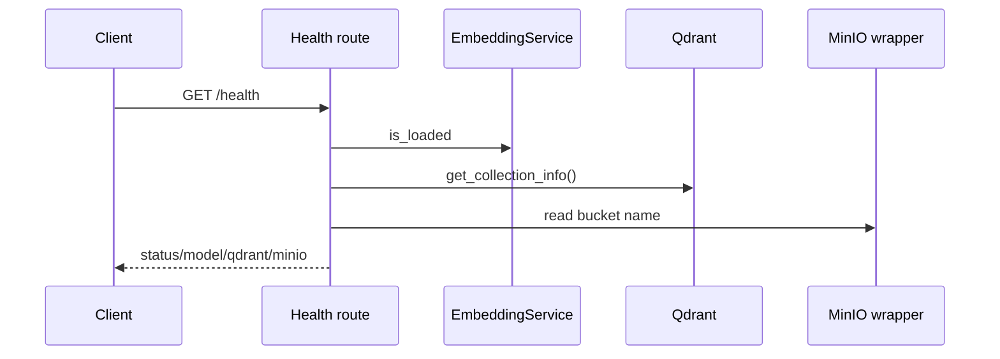
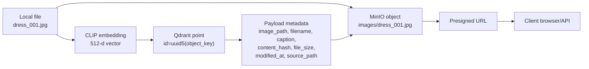

# Data Flows

This document explains the main runtime flows through the service.

## 1. Local Development Startup

This flow is used when a developer runs the API directly from the host machine.
Only Qdrant and MinIO are started through Docker. The app reads `.env`, builds
the FastAPI application, mounts Gradio at `/ui`, and listens on port `8000`.
Because the Python process is outside Docker, it reaches Qdrant and MinIO
through `localhost` ports exposed by Compose.



Key idea: the Python app runs on the host machine, so it connects to sidecars
through `localhost`.

## 2. Production Stack Startup

This flow is used for the production Compose stack. All runtime components run
inside the same Docker network: API, worker, Redis, Qdrant, MinIO, and
Prometheus. The API handles HTTP and UI traffic. The worker handles queued
indexing jobs. Prometheus periodically scrapes the API's `/metrics` endpoint.
Inside this network, services use Compose names instead of `localhost`.



Key idea: containers communicate by Docker service name:

- `http://qdrant:6333`
- `minio:9000`
- `redis://redis:6379/0`

## 3. Text Search

Text search is the main read path. The request enters FastAPI, optionally passes
API key validation, then goes through `SearchService`. The service embeds the
query with CLIP, searches Qdrant, and converts result object keys into MinIO
presigned URLs. The client receives ranked images, scores, captions, filenames,
and URLs that can be opened by the browser.

Request middleware runs before and after the route handler. It accepts an
incoming `X-Request-ID` or generates one, records HTTP metrics, and returns that
request id in the response headers.



Foreground search uses the inference gate with priority over background image
batch indexing. After Qdrant returns ranked payloads, the API resolves each
`image_path` through `ImageService`. MinIO presigned URLs are generated by local
SDK signing logic and returned in the response; this step does not require a
separate thread pool or an object download.

The API accepts text queries up to the configured request schema limit, but CLIP
has a smaller token window. The embedding layer therefore truncates tokenized
queries explicitly before model inference.

## 4. Image Search

Image search follows the same retrieval idea as text search, but the input is a
multipart image upload. The route first applies upload guardrails so the service
does not process unsupported or unexpectedly large files. Pillow decodes the
image into RGB, CLIP embeds it, Qdrant retrieves similar vectors, and the API
returns MinIO presigned URLs for the ranked results.



Image search uses `run_in_threadpool` for blocking decode/model/search work so
the async route does not block the event loop. URL signing at the end is the same
response assembly step used by text search.

Failure behavior:

- unsupported content type: `415`;
- upload exceeds `MAX_UPLOAD_BYTES`: `413`;
- decoded image exceeds `MAX_IMAGE_PIXELS`: `413`;
- invalid image bytes: `400`.

## 5. Indexing With Memory Backend

Memory backend is mainly for local development.

In memory mode, the API process owns both the job registry and the executor.
The route still returns `202 Accepted` with a `job_id`, so the API shape is the
same as Redis mode. The difference is durability: if the API process stops, the
in-memory job state is gone. Use this mode for local development when you do not
want to run Redis.



If the API process exits, in-memory job state is lost. That is acceptable for
local development but not ideal for production.

## 6. Indexing With Redis/RQ Backend

Redis backend is the production path.

In Redis mode, the API only validates the request, writes job metadata, and
enqueues work. The RQ worker process receives the job and executes
`IndexingService.index_directory`. This keeps long ingestion work outside the
HTTP request path and lets clients poll job status independently.



Why this matters: the HTTP request finishes quickly. Large indexing work runs in
the worker, so client/proxy timeouts do not kill the request path.

## 7. Incremental Indexing Internals

This is the core write path inside `IndexingService`. The pipeline checks cheap
state first and only performs expensive work when needed. Metadata comparison is
cheaper than reading the whole file for SHA256. SHA256 is cheaper than CLIP
inference. CLIP inference and MinIO upload happen only for new or changed
images. Qdrant is upserted per batch so progress is persisted incrementally.



This flow avoids repeated CLIP inference for unchanged images and keeps memory
bounded by batch size. The Qdrant state lookup retrieves only the payload fields
needed to decide whether an image changed: `file_size`, `modified_at`,
`content_hash`, and `image_path`. The Qdrant write step is chunked by
`QDRANT_UPSERT_BATCH_SIZE`; this keeps request size tunable independently from
`INGEST_BATCH_SIZE`, which controls how many images are encoded by CLIP at once.

Current indexing is intentionally simple and non-recursive: it scans image files
directly under `images_dir`. It also builds object keys from filenames only. That
fits the included flat DeepFashion-style dataset, but recursive catalogs or
duplicate filenames need a future key strategy such as relative-path keys or
content-addressed keys.

Captions are optional. When `CAPTIONS_PATH` exists, it is currently parsed as one
JSON object before scanning. For very large catalogs, replace this with lazy
caption lookup to avoid unnecessary worker memory pressure.

## 8. CLI Scheduled Ingestion

Scheduled ingestion uses the same job backend as the API. A cron job, systemd
timer, or manual shell command calls `clip-index-enqueue`, which creates a Redis
job. The worker then processes the folder. This avoids embedding deployment
logic in cron and keeps all ingestion state visible through the same job status
API.



The CLI requires:

```env
INDEXING_JOB_BACKEND=redis
```

## 9. Health And Metrics

Health and metrics are operational read paths. `/health` is intended for humans,
load balancers, and deployment smoke checks. It reports whether the API can read
basic Qdrant state and returns the configured MinIO bucket name. `/metrics` is
intended for Prometheus and exposes counters/histograms for request latency,
search latency, embedding latency, and indexing job outcomes.

`GET /health`:



`GET /health` catches Qdrant probe errors and returns them in the `qdrant`
field. The MinIO part is lighter: it reports the configured bucket name from the
object store wrapper and does not download or stat an object.

`GET /metrics` returns Prometheus metrics when `ENABLE_METRICS=true`; otherwise
the route returns `404`.

Metrics include:

- HTTP request count and latency;
- search latency;
- embedding latency;
- indexing job terminal counts.

## 10. Storage Shape

Each indexed image has two persisted representations. MinIO stores the binary
image object. Qdrant stores the vector and metadata payload. The payload's
`image_path` points back to the MinIO object key. Search only returns Qdrant
hits; `ImageService` turns those keys into temporary presigned URLs for clients.



Qdrant is the search index. MinIO is the binary image store. The shared key is
`image_path`, which points from Qdrant payload to the MinIO object key. In the
current flat-folder indexing flow, that object key is `images/<filename>`.
