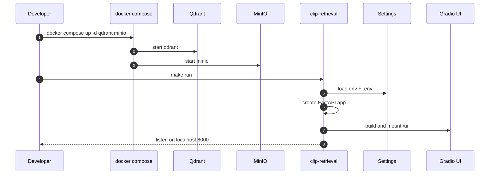
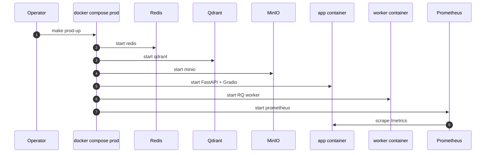
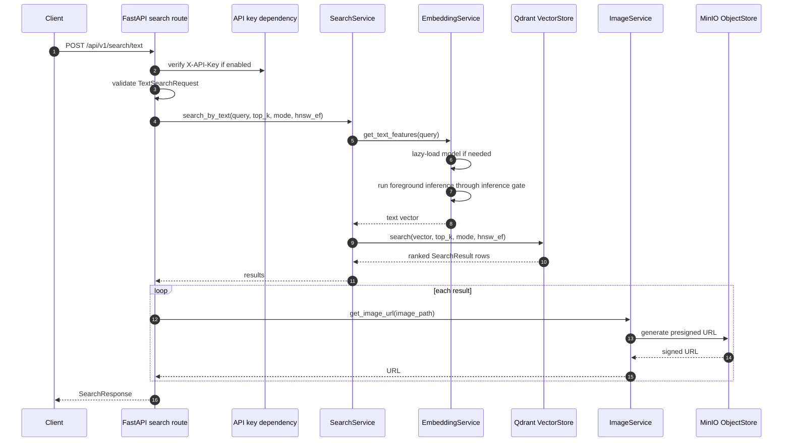
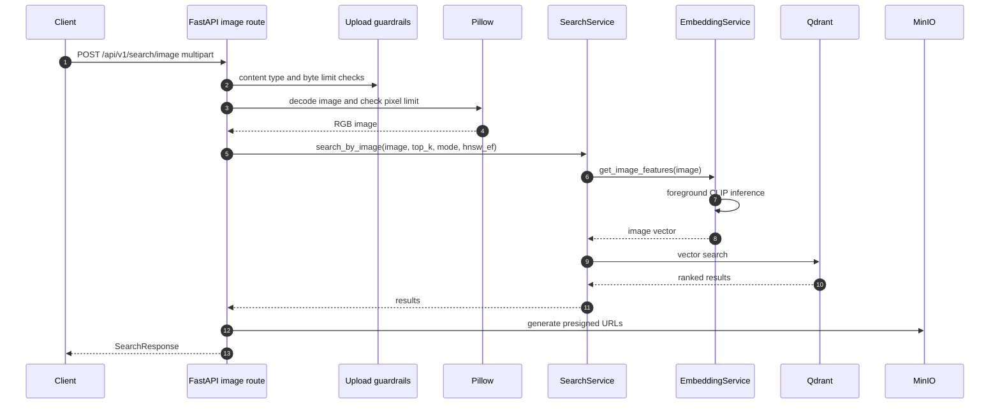
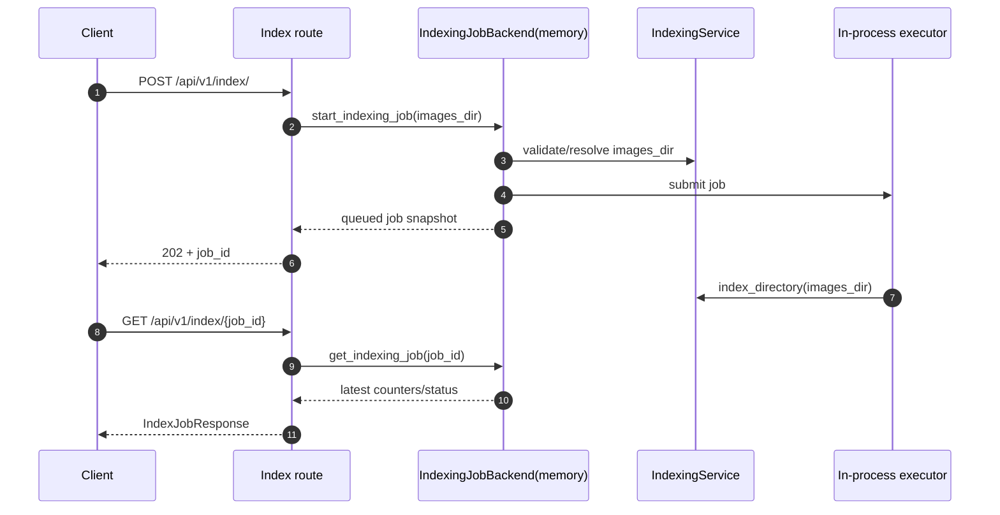
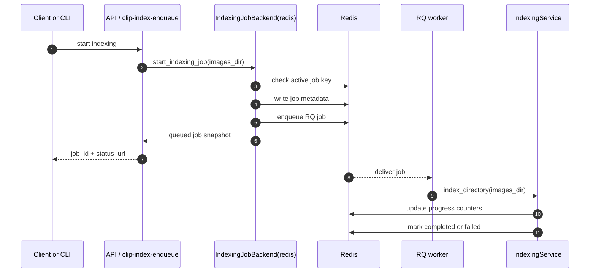
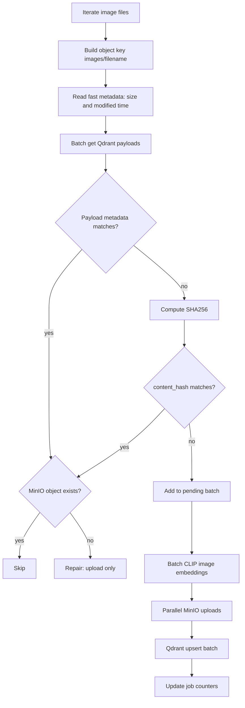
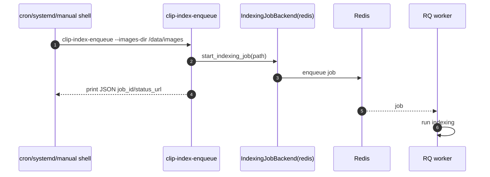
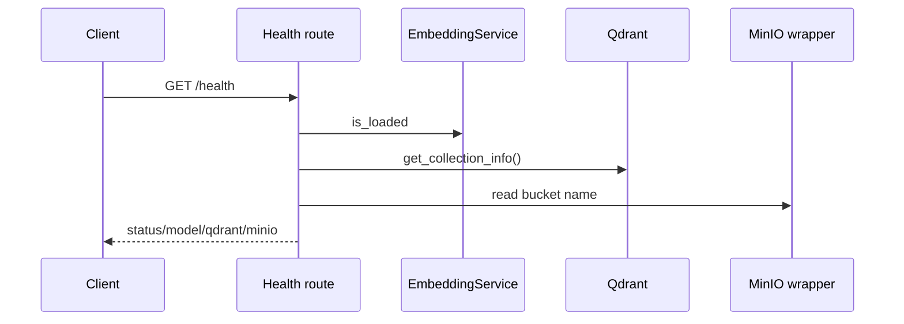
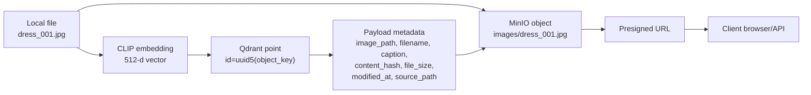

# Data Flows

This document explains the main runtime flows through the service.

## 1. Local Development Startup



Key idea: the Python app runs on the host machine, so it connects to sidecars
through `localhost`.

## 2. Production Stack Startup



Key idea: containers communicate by Docker service name:

- `http://qdrant:6333`
- `minio:9000`
- `redis://redis:6379/0`

## 3. Text Search



Foreground search uses the inference gate with priority over background image
batch indexing.

## 4. Image Search



Failure behavior:

- unsupported content type: `415`;
- upload exceeds `MAX_UPLOAD_BYTES`: `413`;
- decoded image exceeds `MAX_IMAGE_PIXELS`: `413`;
- invalid image bytes: `400`.

## 5. Indexing With Memory Backend

Memory backend is mainly for local development.



If the API process exits, in-memory job state is lost. That is acceptable for
local development but not ideal for production.

## 6. Indexing With Redis/RQ Backend

Redis backend is the production path.



Why this matters: the HTTP request finishes quickly. Large indexing work runs in
the worker, so client/proxy timeouts do not kill the request path.

## 7. Incremental Indexing Internals



This flow avoids repeated CLIP inference for unchanged images and keeps memory
bounded by batch size.

## 8. CLI Scheduled Ingestion



The CLI requires:

```env
INDEXING_JOB_BACKEND=redis
```

## 9. Health And Metrics

`GET /health`:



`GET /metrics` returns Prometheus metrics when `ENABLE_METRICS=true`.

Metrics include:

- HTTP request count and latency;
- search latency;
- embedding latency;
- indexing job terminal counts.

## 10. Storage Shape



Qdrant is the search index. MinIO is the binary image store. The shared key is
`image_path`, which points from Qdrant payload to the MinIO object key.
